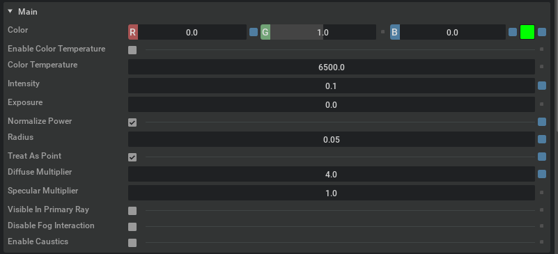
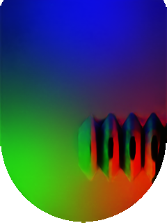

# TactSim-IsaacLab

A vision-based tactile simulator for gelsight tactile sensors based on IsaacLab.

## Setup

The demo was tested on Ubuntu 22.04 with an Nvidia RTX 4070ti.
- Driver version: 535.183.01
- CUDA: 12.3 
- IsaacSim: 4.0

Install the IsaacLab conda environment following the [instructions](https://isaac-sim.github.io/IsaacLab/source/setup/installation/binaries_installation.html).

## Tactile Simulation

This project demonstrates how to build a tactile simulation by reproducing the real mechanics adopted by GelSight sensors. We use [DIGIT](https://digit.ml/) as a demo. Compared with other common methods, such as recovering from depth images or rendering the RGB image in a separate scene, our method requires minimal modifications and fully leverages the capabilities of IsaacSim. It is easy to parallelize and can collect data much faster by running multiple RL environments simultaneously.
We follow the steps below to integrate the tactile simulation into our environment:
### 1. Modify the Surface Material
 In IsaacSim, we adjust RigidBody compliant contact stiffness to approximate the deformation of gel surfaces. However different models can have slightly different stiffness parameters. Here we adjust the parameters for the DIGIT finger-tip as follows, remember to bind the physics material to the core mesh.
 
### 2. Setup Lights
 We use `SphereLight` in Omniverse to simulate the LED light source. Modify the light parameters as follows, then make two duplicates (a total of 3, R, G, and B respectively) and place them according to their real positions.
 
### 3. Setup the Camera
 Mount the camera in the middle of the base facing the core mesh. The camera configuration is shown in [next section](#4-integrate-components-into-the-simulation). Remember to adjust the focal length and focus distance accordingly.
### 4. Integrate Components into the Simulation
Steps above are all we need for tactile image simulation. Then we need to integrate them into the simulation. During scene configuration, put the camera and lights under the prim path of the DIGIT finger body so that they will be integrated. For example, you can do this in the following way
```
camera_l = CameraCfg(
        prim_path="{ENV_REGEX_NS}/Robot/finger_left_tip_body/front_cam",
        update_period=0.01,
        height=320,
        width=240,
        data_types=["rgb", "distance_to_image_plane"],
        spawn=sim_utils.PinholeCameraCfg(
            focal_length=115, focus_distance=0.0015, horizontal_aperture=20.955, clipping_range=(0.1, 1e5)
        ),
        offset=CameraCfg.OffsetCfg(pos=(0.003,0,-0.1),rot=ori, convention="opengl"),
    )
camera_light_l = AssetBaseCfg(
        prim_path="{ENV_REGEX_NS}/Robot/finger_left_tip_body/L", spawn=sim_utils.UsdFileCfg(usd_path="assets/lights.usda"), init_state=AssetBaseCfg.InitialStateCfg(pos=(0.006, 0, -0.003)))
```
5. Image post-processing. We can process the images by first saving the static tactile image i.e., sensor output when there is no contact. Then, we can substract our sensor output by this static image and then add the difference to a real static image to approximate a real output. This is inspired by [tacto](https://github.com/facebookresearch/tacto).

A demo of raw output and refined output is shown as follows.
 
## Usage
```
python demo_ts.py ## Run demo, refined output is save at output_image.jpg, direct output is saved at input_img.png, and difference is saved at subtracted_img.png.
```
Note that some utility functions in `img_utils.py` can be used to get boundary indices and post-processing (including blurring image and adding Gaussian noises to outputs).

## Acknowledgements

We borrowed some materials from [tacto](https://github.com/facebookresearch/tacto) and  [tactile_gym](https://github.com/ac-93/tactile_gym).